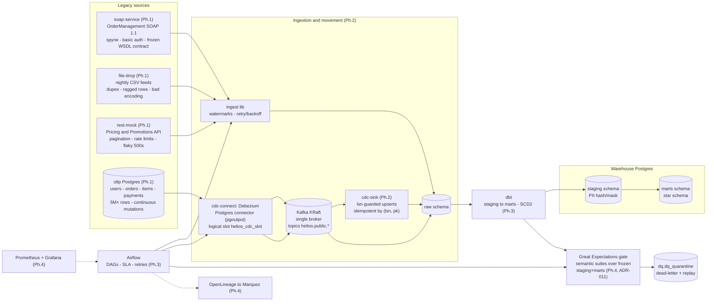

# HELIOS — Legacy-to-Lakehouse ETL Modernization Platform

> A containerized enterprise data platform that modernizes legacy SOAP services, flat-file
> batch feeds, REST APIs, and OLTP database changes (CDC) into a governed dimensional
> warehouse — with orchestrated ETL, data-quality gates, lineage tracking, and full
> observability.

**This is a personal portfolio project** (not employment work). Every claim in this README
maps to a `make` target or a file you can check. Every number in the docs comes from a
measured run recorded in [`EVIDENCE/`](EVIDENCE/).

## Status

| Phase | Scope | Status |
|---|---|---|
| 0 | Scaffold: compose baseline, Makefile, state files, ADR-000 | ✅ done — [EVIDENCE/phase-0.md](EVIDENCE/phase-0.md) |
| 1 | Sources: SOAP service, REST mock, dirty file feeds, OLTP seeder | ✅ done — [phase-1-soap](EVIDENCE/phase-1-soap.md) / [phase-1-oltp](EVIDENCE/phase-1-oltp.md) / [phase-1-rest](EVIDENCE/phase-1-rest.md) / [phase-1-filedrop](EVIDENCE/phase-1-filedrop.md) |
| 2 | Movement: Debezium CDC → Kafka → raw zone; batch extractors | ✅ done — [phase-2-cdc](EVIDENCE/phase-2-cdc.md) / [phase-2-ingest](EVIDENCE/phase-2-ingest.md) / roll-up [phase-2](EVIDENCE/phase-2.md) |
| 3 | Warehouse & dbt: star schema, SCD2, Airflow DAGs, `make run-etl` | ✅ done — [EVIDENCE/phase-3.md](EVIDENCE/phase-3.md) roll-up |
| 4 | Trust & observability: Great Expectations gates ([phase-4-dq](EVIDENCE/phase-4-dq.md)), Marquez lineage, Prometheus/Grafana | 🔶 item 10 done |
| 5 | Chaos & performance: `make chaos-test`, `make bench` | ⬜ |
| 6 | Package: RUNBOOK, data dictionary, interview defense pack | ⬜ |

Current state: see [STATE.md](STATE.md) (always current) and [BACKLOG.md](BACKLOG.md).

## Quickstart (Phase 0 baseline)

```bash
make up          # start + wait until every container is healthy
make ps          # all containers healthy
make smoke-test  # Phase 0: infra checks PASS, E2E E2E checks fail LOUDLY by design (exit 1)
make down        # stop (data volumes preserved)
```

Measured on the dev machine (12 vCPU, rootless Docker, see `EVIDENCE/phase-0.md`):
cold `make up` after images are present ≈ 80 s. First run additionally downloads
images once (~3.2 GB: Airflow 2.14 GB + Kafka 628 MB + Postgres 420 MB).

First run creates `.env` from `.env.example` (local-dev defaults) automatically.

### What is running now

| Service | URL / conn | Credentials (.env) |
|---|---|---|
| Airflow UI | http://localhost:8080 | `AIRFLOW_WWW_USER` / `AIRFLOW_WWW_PASSWORD` |
| OLTP Postgres (source) | localhost:5432, db `oltp` | `OLTP_POSTGRES_USER` / `OLTP_POSTGRES_PASSWORD` |
| Warehouse Postgres | localhost:5433, db `warehouse` (schemas `raw`, `staging`, `marts`) | `WAREHOUSE_POSTGRES_USER` / `WAREHOUSE_POSTGRES_PASSWORD` |
| Kafka (host listener) | localhost:29092 | n/a (PLAINTEXT, local dev) |
| SOAP OrderManagement (legacy source, Phase 1) | http://localhost:8000/?wsdl (WSDL), `/health` (unauthenticated) | `SOAP_BASIC_AUTH_USER` / `SOAP_BASIC_AUTH_PASSWORD` (HTTP basic auth; required on every SOAP path incl. WSDL) |
| OLTP seeder / mutator (Phase 1) | one-shot + long-running containers; mutator `/health` is internal (:8081, healthcheck only) | reuses `OLTP_POSTGRES_*` |

`make smoke-test` exits non-zero on any health mismatch; Stage 2 (ETL assertions) is
intentionally unimplemented until Phase 3 — this loud failure is the Phase 0 definition
of done.

## Architecture (target — components annotated with the phase that delivers them)



The shipped reality always outruns this static file — [STATE.md](STATE.md) is the
current state and each phase's CRITIC review checks the repo against the diagram.

### Source 1: soap-service (Phase 1)

Legacy "OrderManagement" SOAP 1.1 service ([ADR-001](DECISIONS/adr-001-soap-service.md)):
spyne, HTTP basic auth, operations `CreateOrder / GetOrders / GetOrderStatus /
UpdateOrderStatus`, state machine NEW→PROCESSING→SHIPPED→DELIVERED (+CANCELLED from
NEW/PROCESSING), idempotent `CreateOrder` via `client_reference`, faults
(`OrderNotFound`, `InvalidStateTransition`, `ValidationError`,
`ClientReferenceConflict`). Owns its own SQLite store on the `soap_data` volume
(deliberately NOT the OLTP Postgres — independent source systems), seeded
deterministically with 3 years of order history on first boot.

```bash
make seed-soap          # row counts + gross revenue report (idempotent)
make smoke-soap         # zeep round-trip: create/replay/status/transition-fault/pagination
make test-soap          # pytest suite in a throwaway container (35 tests)
make contract-freeze    # re-capture contract/OrderManagement.wsdl after a WSDL change
```

The golden WSDL artifact at `soap-service/contract/OrderManagement.wsdl` is the frozen
contract; `tests/test_wsdl_golden.py` fails if the served WSDL drifts from it.

### Source 2: file-drop (Phase 1)

Nightly CSV feed generator ([ADR-004](DECISIONS/adr-004-file-drop.md)) writing
`customers-<date>.csv` (5,000 rows, PII-carrying) and `products-<date>.csv` (2,000 rows,
OLTP-coherent SKUs/prices) into an SFTP-style drop volume, with seeded, classified dirt:
~2% verbatim duplicate rows, ragged columns (short *and* long), one cp1252-encoded row
inside the UTF-8 file, and `--late-offset` backdating for late-arrival simulation.
Same inputs ⇒ byte-identical files (replayable extractor bugs).

```bash
make drop-generate       # emit today's feeds with all dirt modes
make drop-generate-late  # late-arrival simulation (backdated 2 days)
make drop-ls             # inspect the drop volume
make test-drop           # 15 dirt-classification/CLI tests
```

### Source 3: rest-mock (Phase 1)

Mock "Pricing & Promotions" API ([ADR-003](DECISIONS/adr-003-rest-mock.md)): FastAPI at
`http://localhost:8001` with opaque-cursor keyset pagination (`/promotions`,
`/products`), per-API-key token-bucket rate limiting (429 + `Retry-After`,
`X-RateLimit-Remaining`), and deterministic seeded flaky 500s (`retryable: true` body).
Prices are integer cents and coherent with the OLTP item-price formula. `/health` is
never limited and never flakes.

```bash
make test-rest      # 34 pytest tests (pagination walk, bucket math, flake determinism)
make smoke-rest     # walks ALL 2,500 promotions, retrying real 429s/500s
```

### Source 4: oltp (Phase 1)

The "modern" OLTP source ([ADR-002](DECISIONS/adr-002-oltp-source.md)): normalized
`users / orders / order_items / payments` schema applied by a seeder (never by rebuilding
the volume), **5.4M rows** loaded via a single atomic COPY transaction, and a
continuous mutation loop (status walks, logins, bounded inserts/deletes) generating
measured WAL churn for Phase-2 Debezium CDC.

```bash
make seed-oltp      # idempotent seed + self-healing constraints (skip if already seeded)
make oltp-status    # row counts, on-disk sizes, 15s measured WAL delta
make test-oltp      # 26 pytest tests against a dedicated oltp_test db
make reseed-oltp    # DESTRUCTIVE (OLTP source only): truncate + reload
```

## Repository layout

```
docker-compose.yml     platform definition (Phase 0 baseline)
Makefile               up / down / ps / logs / smoke-test / clean (+ env helper)
infra/warehouse/init/  warehouse bootstrap SQL (raw/staging/marts schemas)
scripts/               wait-healthy.sh, smoke-test.sh (grows per phase)
soap-service/          (Ph.1 ✅) legacy SOAP OrderManagement: spyne, basic auth,
                       deterministic 3y seed, zeep smoke client, frozen WSDL contract
rest-mock/             (Ph.1 ✅) flaky REST pricing API: cursor paging, 429s, seeded 500s (ADR-003)
file-drop/             (Ph.1 ✅) nightly CSV drop zone + dirty-file generator (ADR-004)
oltp/                  (Ph.1 ✅) OLTP schema + 5.4M-row COPY seeder + mutation loop (ADR-002)
ingest/                (Ph.2 ✅) batch extractors: watermark cursors, Retry-After
                       backoff, content-hash idempotent raw landing, quarantine (ADR-006/007)
dags/                  (Ph.3) Airflow DAGs
dbt/                   (Ph.3 ✅ staging) dbt project: 9 typed staging models over raw,
                       PII hashing (SHA-256 + env salt), freshness + 81 tests (ADR-008)
dq/                    (Ph.4) Great Expectations suites + quarantine
observability/         (Ph.4) Prometheus/Grafana config, Marquez
DECISIONS/             ADRs — why the platform looks like this
EVIDENCE/              verifier logs + metrics; the source of every number we claim
docs/                  RUNBOOK.md, DATA_DICTIONARY.md, INTERVIEW_DEFENSE.md
STATE.md               one-screen session state; read me first
BACKLOG.md             ordered work items
```

## Operating the platform

See [docs/RUNBOOK.md](docs/RUNBOOK.md) — start/stop, health, logs, destructive ops,
troubleshooting, and the rootless-Docker bootstrap used on the dev machine this was
built on.

## License / honesty

Personal portfolio project by a Solution Architect candidate. Built to be broken into:
try `make chaos-test` (Phase 5) and read [docs/INTERVIEW_DEFENSE.md](docs/INTERVIEW_DEFENSE.md)
for known limitations — including where this design falls over at 100× scale.
