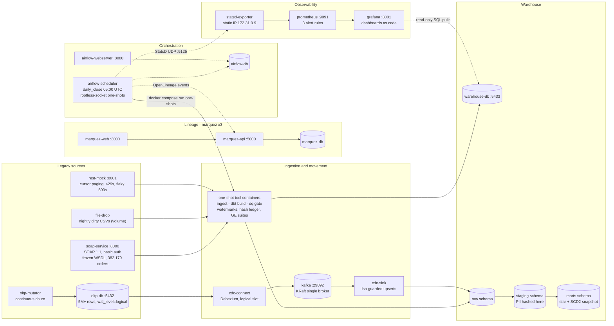

# HELIOS - Legacy-to-Lakehouse ETL Modernization Platform

> A containerized enterprise data platform that modernizes legacy SOAP services, flat-file
> batch feeds, REST APIs, and OLTP database changes (CDC) into a governed dimensional
> warehouse - with orchestrated ETL, data-quality gates, lineage tracking, and full
> observability.

**This is a personal project** (not employment work), built in the open. Every claim in
this README maps to a `make` target or a file you can check. Every number in the docs
comes from a measured run recorded in [`EVIDENCE/`](EVIDENCE/).

## Status

| Phase | Scope | Status |
|---|---|---|
| 0 | Scaffold: compose baseline, Makefile, state files, ADR-000 | ✅ done - [EVIDENCE/phase-0.md](EVIDENCE/phase-0.md) |
| 1 | Sources: SOAP service, REST mock, dirty file feeds, OLTP seeder | ✅ done - [phase-1-soap](EVIDENCE/phase-1-soap.md) / [phase-1-oltp](EVIDENCE/phase-1-oltp.md) / [phase-1-rest](EVIDENCE/phase-1-rest.md) / [phase-1-filedrop](EVIDENCE/phase-1-filedrop.md) |
| 2 | Movement: Debezium CDC → Kafka → raw zone; batch extractors | ✅ done - [phase-2-cdc](EVIDENCE/phase-2-cdc.md) / [phase-2-ingest](EVIDENCE/phase-2-ingest.md) / roll-up [phase-2](EVIDENCE/phase-2.md) |
| 3 | Warehouse & dbt: star schema, SCD2, Airflow DAGs, `make run-etl` | ✅ done - [EVIDENCE/phase-3.md](EVIDENCE/phase-3.md) roll-up |
| 4 | Trust & observability: Great Expectations gates ([phase-4-dq](EVIDENCE/phase-4-dq.md)), Marquez lineage ([phase-4-lineage](EVIDENCE/phase-4-lineage.md)), Prometheus + Grafana ([phase-4-metrics](EVIDENCE/phase-4-metrics.md)) | ✅ done |
| 5 | Chaos & performance: [chaos 7/7](EVIDENCE/phase-5-chaos.md) (ADR-014), [bench → metrics.md](EVIDENCE/metrics.md) (ADR-015) | ✅ done |
| 6 | Package: [RUNBOOK](docs/RUNBOOK.md) + drill (ADR-016), [DATA_DICTIONARY](docs/DATA_DICTIONARY.md), [INTERVIEW_DEFENSE](docs/INTERVIEW_DEFENSE.md) (54 Q&A, ESB mapping, AliCloud notes) | ✅ done - project CLOSED 2026-09-15 |

Want to see it without running it? Real captures of the live UIs are in
[`screenshots/`](screenshots/) (Airflow grid, Grafana dashboard, Marquez lineage).

## Quickstart

```bash
make up          # start + wait until every container is healthy
                 # (fresh volume: ends non-zero on cdc-sink by design until the one-time
                 #  `make cdc-setup && docker compose restart cdc-sink`, then `make up` again)
make ps          # all containers healthy
make smoke-test  # Stage 1: 26 infra checks + Stage 2: a real orchestrated close + parity/SCD2/dead-letter/lineage/metrics assertions (exit 0)
make down        # stop (data volumes preserved)
```

First run creates `.env` from `.env.example` (local-dev defaults) automatically, pulls
the images once (sizes visible via `docker images` - Airflow is the big one), and seeds
the sources (SOAP ~382k orders ~44 s; OLTP 5.4M rows ~3.5 min - `EVIDENCE/phase-1-*.md`).
The full fresh-clone walk - including the one-time CDC bootstrap and first close - is the
[recover-from-scratch drill](docs/RUNBOOK.md#4-recovery-from-scratch-drill--the-honest-version-adr-016-d1)
in the RUNBOOK (proven at Phase-0 code state; re-verification on a scratch
machine is named future work, ADR-016 D1).

First run creates `.env` from `.env.example` (local-dev defaults) automatically.

### What is running now

| Service | URL / conn | Credentials (.env) |
|---|---|---|
| Airflow UI | http://localhost:8080 | `AIRFLOW_WWW_USER` / `AIRFLOW_WWW_PASSWORD` |
| OLTP Postgres (source) | localhost:5432, db `oltp` | `OLTP_POSTGRES_USER` / `OLTP_POSTGRES_PASSWORD` |
| Warehouse Postgres | localhost:5433, db `warehouse` (schemas `raw`, `staging`, `marts`) | `WAREHOUSE_POSTGRES_USER` / `WAREHOUSE_POSTGRES_PASSWORD` |
| Kafka (host listener) | localhost:29092 | n/a (PLAINTEXT, local dev) |
| SOAP OrderManagement (legacy source, Phase 1) | http://localhost:8000/?wsdl (WSDL), `/health` (unauthenticated) | `SOAP_BASIC_AUTH_USER` / `SOAP_BASIC_AUTH_PASSWORD` (HTTP basic auth; required on every SOAP path incl. WSDL) |
| Marquez lineage UI (Phase 4, ADR-012) | http://localhost:3000 (graph + column-level views); lineage REST http://localhost:5000, admin :5001 | n/a (unauthenticated, local dev) |
| Grafana dashboards (Phase 4, ADR-013) | http://localhost:3001 (dashboard uid `helios-pipeline`) | `GRAFANA_ADMIN_USER` / `GRAFANA_ADMIN_PASSWORD` |
| Prometheus (Phase 4, ADR-013) | http://localhost:9091 (targets, rules, `/alerts`); scrape + alert config as code in `observability/` | n/a (unauthenticated, local dev) |
| OLTP seeder / mutator (Phase 1) | one-shot + long-running containers; mutator `/health` is internal (:8081, healthcheck only) | reuses `OLTP_POSTGRES_*` |

`make smoke-test` runs 26 Stage-1 infra checks and a full Stage-2 E2E
verification (an orchestrated daily_close run + mart parity, SCD2, dead-letter,
lineage and metrics assertions) and exits non-zero on any mismatch.

### Lineage (Phase 4, ADR-012)

`daily_close` tasks and the wrapped dbt build emit OpenLineage to Marquez. The
graph is **dbt's raw sources → staging → marts** (the ingest→raw hop is
job-level only - the emit boundary is stated verbatim in ADR-012 D2), with
column-level lineage into marts (e.g. `dim_customer.customer_sk ─→
fct_orders.customer_sk`). Verify it yourself:

```bash
make lineage-verify   # API-asserted: datasets, daily_close jobs incl. dq_gate, column lineage; dumps EVIDENCE JSON
make run-etl          # a full close emits fresh events (dbt_build runs dbt-ol; every task emits via the provider)
```

The pipeline is non-fatal when Marquez is down (drilled: full close green with
the api stopped; events resume on return - `EVIDENCE/phase-4-lineage/drill-marquez-down.log`).

### Metrics & alerting (Phase 4, ADR-013)

Airflow 2.10.5 emits StatsD (the only metrics egress the installed version
has - verified in the running image; names verified against the installed
source, not blogs) → `statsd-exporter` maps the name-encoded legacy metrics
(`airflow_task_finish_total{dag_id,task_id,state}`,
`airflow_dagrun_duration_seconds{dag_id,status}` histogram,
`airflow_scheduler_heartbeat`) → Prometheus scrapes + evaluates three alert
rules → Grafana renders [dashboards as code](observability/grafana/).
Row counts and task durations are read-only SQL pulls (warehouse-db /
airflow-db datasources) - observability only ever pulls; UDP is
dropped-not-queued; no `depends_on` touches the metrics stack. Drills:
`make metrics-drill` (a rule genuinely fires on a stopped scraped target,
then recovers) and the full-stack non-fatal drill (two closes green with
Prometheus + Grafana + the exporter stopped; `NoStatsLogger` fallback in the
scheduler's own logs) - `EVIDENCE/phase-4-metrics.md`.

```bash
make metrics-verify   # API-asserted: targets up, rules loaded, real metric values, Grafana provisioning; dumps EVIDENCE
make metrics-drill    # alert fire-drill: stop a scraped target → HeliosScrapeTargetDown fires → restart → resolves
```

Honest ceiling: NO Alertmanager and no push channel exists - rules surface as
the ALERTS series, Prometheus `/alerts`, and the dashboard's firing-alerts
table; nothing notifies anyone. Metrics history is derived ephemeral state
(wipe story in ADR-013 D4: not re-derivable, unlike lineage).

### Chaos engineering (Phase 5, ADR-014)

Seven scripted destructive scenarios - each one: pre-state measurement →
chaos act → assert the platform DEGRADES SAFELY (named mechanism, measured
while degraded) → recovery → a measured convergence proof. Full transcripts
in `EVIDENCE/chaos-*.log`, roll-up with the numbers in
`EVIDENCE/phase-5-chaos.md`:

```bash
make chaos-test                      # all 7, in order (~60-90 min wall, measured)
make chaos-test SCENARIO=poison_cdc  # one scenario: number (01..07) or name
```

Scenarios: `kill_worker` (SIGKILL the dbt one-shot mid-build → the Airflow
task retry converges the SAME run; snapshot invariant bit-identical),
`kill_warehouse_midbuild` (warehouse-db down mid-build → the build fails
loudly, the published layer is never partial - dbt commits per-model, so
every target is a complete replacement - and the retry rebuilds on the
restored DB),
`kill_oltp_midcdc` (source down → the replication slot holds; **measured: a
FAILED Debezium task does not self-recover - the scripted recovery restarts
the task via the Connect API**; retained WAL peak/drain measured),
`poison_cdc` / `poison_csv` (the Session-9 injections scripted: gate red →
dead-letter → **HeliosAirflowTaskFailure fires, 69–80 s measured across three
executions; final-suite transcripts 69/73 s** → source
fix → green close → `dq-replay` resolves; row-level targeting re-proven),
`schema_drift` (ADD COLUMN proven invisible end-to-end - the honest gap -
plus a guarded rename probe: the mutator fails loudly, the pipeline would
not detect it either; both reverted), `api_outage` (**the dependency
contract self-heals stopped/paused/partitioned sources - measured 3 ways -
so the outage is a watchdog-enforced network partition; task failures are
loud, in-run retries converge, raw counts bit-identical**).

Destructive by design, re-runnable (ADR-014 D7): quarantine only ever grows
by RESOLVED audit rows; `dq.dq_quarantine` ends 0 OPEN. Smoke-test is the
green-state guard and does not grow.

### Bench (Phase 5, ADR-015)

`make bench` times the REAL pipeline per stage - every rate is a measured row
count ÷ a measured wall, traceable to a transcript in `EVIDENCE/bench-*.log`,
rolled up with date + hardware in [EVIDENCE/metrics.md](EVIDENCE/metrics.md).
Three complete 6/6-leg passes (incl. the CRITIC's independent re-run); the
honest headline BANDS (never a single run; this laptop, not production):

| Stage | Band (three passes) |
|---|---|
| dbt full re-materialization (14 models + snapshot - the platform's real full load) | **14,095,849–14,136,532 rows in 65–82 s = 172k–217k rows/s** (the ~5.45M-row items table: ~300–334k staged) |
| SOAP full walk (READ; landed=0 by idempotence) | 382,179 rows @ 2,637–2,773 rows/s |
| CDC applied drain (live mutator, lag=0) | 7.4–7.7 events/s - the mutator's pace, not a ceiling (≈6.3k events/s measured at snapshot drain) |
| GE semantic gate scan (6 suites) | ~8.5M rows @ 608k–766k rows/s |
| Orchestrated `daily_close` end-to-end | 150.7–163.4 s server-side, 5/5 tasks green (dbt_build 69–82 s, dq_gate 16–17 s) |

## Architecture (target - components annotated with the phase that delivers them)



The 17 long-running containers this diagram maps to: `oltp-db`, `oltp-mutator`,
`soap-service`, `rest-mock`, `kafka`, `cdc-connect`, `cdc-sink`, `warehouse-db`,
`airflow-webserver`, `airflow-scheduler`, `airflow-db`, `marquez-db`,
`marquez-api`, `marquez-web`, `statsd-exporter`, `prometheus`, `grafana` - all
healthy after one `make up` (the batch tools are one-shot containers, run by
`make` or by the scheduler, never long-lived).

The shipped reality always outruns this static file - each milestone's review checks the
repo against the diagram.

### Source 1: soap-service (Phase 1)

Legacy "OrderManagement" SOAP 1.1 service ([ADR-001](DECISIONS/adr-001-soap-service.md)):
spyne, HTTP basic auth, operations `CreateOrder / GetOrders / GetOrderStatus /
UpdateOrderStatus`, state machine NEW→PROCESSING→SHIPPED→DELIVERED (+CANCELLED from
NEW/PROCESSING), idempotent `CreateOrder` via `client_reference`, faults
(`OrderNotFound`, `InvalidStateTransition`, `ValidationError`,
`ClientReferenceConflict`). Owns its own SQLite store on the `soap_data` volume
(deliberately NOT the OLTP Postgres - independent source systems), seeded
deterministically with 3 years of order history on first boot.

```bash
make seed-soap          # row counts + gross revenue report (idempotent)
make smoke-soap         # zeep round-trip: create/replay/status/transition-fault/pagination
make test-soap          # pytest suite in a throwaway container (35 tests)
make contract-freeze    # re-capture contract/OrderManagement.wsdl after a WSDL change
```

The golden WSDL artifact at `soap-service/contract/OrderManagement.wsdl` is the frozen
contract; `tests/test_wsdl_golden.py` fails if the served WSDL drifts from it.

### Source 2: file-drop (Phase 1)

Nightly CSV feed generator ([ADR-004](DECISIONS/adr-004-file-drop.md)) writing
`customers-<date>.csv` (5,000 rows, PII-carrying) and `products-<date>.csv` (2,000 rows,
OLTP-coherent SKUs/prices) into an SFTP-style drop volume, with seeded, classified dirt:
~2% verbatim duplicate rows, ragged columns (short *and* long), one cp1252-encoded row
inside the UTF-8 file, and `--late-offset` backdating for late-arrival simulation.
Same inputs ⇒ byte-identical files (replayable extractor bugs).

```bash
make drop-generate       # emit today's feeds with all dirt modes
make drop-generate-late  # late-arrival simulation (backdated 2 days)
make drop-ls             # inspect the drop volume
make test-drop           # 15 dirt-classification/CLI tests
```

### Source 3: rest-mock (Phase 1)

Mock "Pricing & Promotions" API ([ADR-003](DECISIONS/adr-003-rest-mock.md)): FastAPI at
`http://localhost:8001` with opaque-cursor keyset pagination (`/promotions`,
`/products`), per-API-key token-bucket rate limiting (429 + `Retry-After`,
`X-RateLimit-Remaining`), and deterministic seeded flaky 500s (`retryable: true` body).
Prices are integer cents and coherent with the OLTP item-price formula. `/health` is
never limited and never flakes.

```bash
make test-rest      # 34 pytest tests (pagination walk, bucket math, flake determinism)
make smoke-rest     # walks ALL 2,500 promotions, retrying real 429s/500s
```

### Source 4: oltp (Phase 1)

The "modern" OLTP source ([ADR-002](DECISIONS/adr-002-oltp-source.md)): normalized
`users / orders / order_items / payments` schema applied by a seeder (never by rebuilding
the volume), **5.4M rows** loaded via a single atomic COPY transaction, and a
continuous mutation loop (status walks, logins, bounded inserts/deletes) generating
measured WAL churn for Phase-2 Debezium CDC.

```bash
make seed-oltp      # idempotent seed + self-healing constraints (skip if already seeded)
make oltp-status    # row counts, on-disk sizes, 15s measured WAL delta
make test-oltp      # 26 pytest tests against a dedicated oltp_test db
make reseed-oltp    # DESTRUCTIVE (OLTP source only): truncate + reload
```

## Repository layout

```
docker-compose.yml     platform definition (Phase 0 baseline)
Makefile               up / down / ps / logs / smoke-test / clean (+ env helper)
infra/warehouse/init/  warehouse bootstrap SQL (raw/staging/marts schemas)
scripts/               wait-healthy.sh, smoke-test.sh (grows per phase)
soap-service/          (Ph.1 ✅) legacy SOAP OrderManagement: spyne, basic auth,
                       deterministic 3y seed, zeep smoke client, frozen WSDL contract
rest-mock/             (Ph.1 ✅) flaky REST pricing API: cursor paging, 429s, seeded 500s (ADR-003)
file-drop/             (Ph.1 ✅) nightly CSV drop zone + dirty-file generator (ADR-004)
oltp/                  (Ph.1 ✅) OLTP schema + 5.4M-row COPY seeder + mutation loop (ADR-002)
ingest/                (Ph.2 ✅) batch extractors: watermark cursors, Retry-After
                       backoff, content-hash idempotent raw landing, quarantine (ADR-006/007)
dags/                  (Ph.3) Airflow DAGs
dbt/                   (Ph.3 ✅) dbt project: 14 table models (staging + marts) + the SCD2
                       snapshot, PII hashing (SHA-256 + env salt), 144 tests (ADR-008/009)
dq/                    (Ph.4 ✅) Great Expectations suites + dead-letter quarantine
                       + replay (32 tests, ADR-011)
observability/         (Ph.4 ✅) statsd-exporter mapping, Prometheus scrape+rules,
                       Grafana datasources+dashboard - all as code (ADR-013)
DECISIONS/             ADRs - why the platform looks like this
EVIDENCE/              verifier logs + metrics; the source of every number we claim
docs/                  RUNBOOK.md, DATA_DICTIONARY.md, INTERVIEW_DEFENSE.md
STATE.md               one-screen session state; read me first
BACKLOG.md             ordered work items
```

## Operating the platform

See [docs/RUNBOOK.md](docs/RUNBOOK.md) - start/stop, health, logs, destructive ops,
troubleshooting, and the rootless-Docker bootstrap used on the dev machine this was
built on.

## License / honesty

A personal project by a solution architect candidate, built and documented in the open.
Built to be broken into: try `make chaos-test` and read
[docs/INTERVIEW_DEFENSE.md](docs/INTERVIEW_DEFENSE.md) for known limitations -
including where this design falls over at 100× scale.
